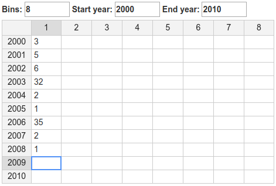

# HODF: Hands-on-dataframe

A wrapper around [handsontable](https://handsontable.com/) spreadsheet for collecting data.frame objects with a dynamic number of columns / rows.



## Installation / Quick start

The package can be installed via. Yarn / NPM:

    npm install shuttlethread/hodf

Include the handsontable CSS in your page, either:

* Include ``node_modules/handsontable/dist/handsontable.min.css``
* Use a CDN, e.g. ``<link href="https://cdn.jsdelivr.net/npm/handsontable@7.1.0/dist/handsontable.full.min.css" rel="stylesheet" media="screen">``

Then you can create the hodf element with:

    var Hodataframe = require('hodf');

    var h = new Hodataframe(
        template,  // Describes requested data, see later
        containing_el,  // HTML element to add HODF to
        (initial_data || {}),  // Initial data frame to populate
    );

Finally you can get the content using:

    console.log(h.getDataFrame());  // R data.frame-like format
    console.log(h.getAofA());  // Array-of-arrays format

## Templates

A template must contain a ``fields`` and ``values`` specification, which detail
how data.frame columns and rows are formed, respectively.

Both should be a dimension object or array of dimension objects that describe
contained data. For example, the following:

```json
{
    "fields": [
        {"name": "species", "title": "Species"},
        {"name": "count", "title": "Count"}
    ],
    "values": {"type": "year", "min": 2000, "max": 2005},
}
```

...will accept / produce data frames of the form:

```json
{
    "_headings": { "fields": ["species", "count"], "values": [2000, 2001, 2002, 2003, 2004, 2005] },
    "species": ["cow", "pig", "duck", "cat", "dog"],
    "count": [0, 1, 2, 3, 4, 5],
}
```

The various types of dimensions are described below.

### Static dimension

A fixed single dimension that will always be present in the data frame. For
example:

```json
    {"name": "species", "title": "Species"},
```

The title can contain translations, e.g:

```json
    {"name": "item_2", "title": {'en': 'Item 2', 'ge': 'ნივთი 2'}},
```

### Optional dimension

A single dimension that the user can turn on/off. "Enabled" specifies whether
it's on by default. For example:

```json
    {"type": "optional", "name": "width", "title": "Width", "enabled": true},
```

### Range dimension

The columns/rows will be a range of numeric values, for which users get to
select min/max value:

```json
{"type": "range", "min": 100, "max": 200}
```

* ``min``: Initial value for minimum in range, if there isn't data provided to initial_data.
* ``max``: Initial value for maximum in range, if there isn't data provided to initial_data.
* ``overall_min``: Users cannot alter the min/max below this value
* ``overall_max``: Users cannot alter the min/max above this value
* ``prefix``: Prefix to add to numeric names/titles, e.g. ``{"name": "y", "title": "Year"}``.

### Year dimension

Special case of range dimension. Users select start/end instead of min/max.

```json
{"type": "year", "min": 2000, "max": 2010}
```

### Bins dimension

Special case of range dimension. Min is hard-coded to 1.

```json
{"type": "bins", "max": 10}
```

### Content type

For fields only, you can specify the type of value it can contain with ``content``. For example

```json
{"type": "range", "min": 100, "max": 200, "content": "numeric"}
```

... or ...

```json
[
    {"name": "species", "title": "Species", "content": ["Cow", "Pig", "Duck"]},
    {"name": "count", "title": "Count", "content": "numeric"}
],
```

Valid options are:-

* An array of possible values, in which case a dropdown will appear
* The name of a [handsontable validator alias](https://handsontable.com/docs/7.1.0/demo-data-validation.html), i.e. ``date``, ``numeric``, ``time``.
* A handsontable cell type object

## Additional optional template fields

Besides fields/values, a template can also contain the following fields:

* ``title``: A title for the table, put in an ``h3`` element before it
* ``description``: A description for the table, put in an ``p`` element before it
* ``name``: A name for the element. Not used internally
* ``orientation``: One of "horizontal" (default), or "vertical". Vertical rotates the table, so that "fields" specifies the row metadata instead of columns

## References

* [handsontable](https://handsontable.com/)

## Acknowledgements

Developed as part of [FarFish](https://www.farfish.eu/), which has received funding from the European Union’s Horizon 2020 research and innovation programme under grant agreement no. 727891.
